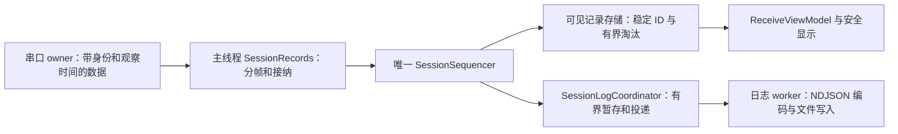

# LazyCom 架构优化方案

状态：研究与建议，尚未实施。基于 2026-09-17 当前工作树；保留此前测试精简及其他未提交修改。

## 1. 结论与范围

可以优化，建议保留现有模块化单进程架构，集中减少内部字符串协议、跨层依赖、分散的事务状态和重复数据表示。

当前已经具备值得保留的基础：独立串口 owner、scanner、日志和持久化 worker；可注入的串口与文件系统接口；强类型 ID；可靠 completion 预留；纯状态机；离线固定依赖。重新引入事件总线、通用 worker 框架或大量接口，会增加维护成本。

推荐先完成 A、B 两阶段的等价重构。C 阶段包含记录链路接入和调度归属调整，收益较大，但涉及资源拒绝边界或跨线程时序，必须作为独立工程项验证，不能以“搬动代码”处理。

产品行为仍以 [Plan.md](../Plan.md) 为准，工程契约以 [DevelopPlan.md](../DevelopPlan.md) 为准。本方案不直接覆盖这两份文档；实施时同步更新已经落地的工程边界。

## 2. 研究依据与现状

本次检查了生产源码清单、CMake target 依赖、公共头文件引用、主要调用链及相关回归测试。重点跟踪：连接与取消、RX/TX 到 UI/日志、日志 rollover 与断开、三类配置保存、定时发送、TUI 输入与覆盖层、正常及 FATAL shutdown。

当前生产代码共 23 个 `.cpp`、16,423 行；项目头文件共 29 个、4,434 行，不含依赖和测试。下面四个实现文件合计 9,577 行，占生产 `.cpp` 行数约 58.3%。行数用于定位职责集中处，不作为强制拆分或删减指标。

| 位置 | 当前规模 | 实际承担的职责 |
| --- | ---: | --- |
| [application.cpp](../src/app/application.cpp) | 2,743 行 | 生命周期、命令校验、配置保存、分帧、记录与日志投递、日志重建、调度、搜索、退出 |
| [tui.cpp](../src/ui/tui.cpp) | 3,149 行 | 输入路由、编辑、覆盖层、配置候选、浏览与搜索坐标、渲染、主循环唤醒 |
| [serial/service.cpp](../src/serial/service.cpp) | 1,958 行 | admission、completion 预留、控制槽、owner 事件循环、I/O、故障与清理 |
| [logging/session_writer.cpp](../src/logging/session_writer.cpp) | 1,727 行 | Linux 目录与配额后端，以及异步 writer 队列与生命周期 |

当前 [CMakeLists.txt](../CMakeLists.txt) 的项目 target 显式依赖未形成循环。下面的反向 include 是源码边界问题，不应误报为链接循环：

- `serial/service.hpp`、`serial/scanner.hpp`、`logging/session_writer.hpp` 引用 `app/` 的协议或信号头；`model/session_sequencer.hpp` 引用 `app/state.hpp`。
- `model/session_record.hpp` 使用日志枚举并提供 `to_log_record()`；`lazycom_data_path` 因此直接依赖整个 `lazycom_logging` target。
- `ui/tui.hpp` 公开声明并不需要 `Application`，却包含整个 `app/application.hpp`，间接展开串口、日志、持久化等实现相关声明。
- `lazycom_core` 当前仅编译 `build_info.cpp`，与工程文档中“核心纯逻辑”的建议含义不同；没有必要仅为目录名称搬动全部代码。

本次为静态研究，没有重新构建、运行测试或测量性能；以下收益均为结构分析，不能视为已取得的性能结果。

## 3. 必须保持的行为

| 边界 | 等价重构验收要求 |
| --- | --- |
| 用户操作 | 快捷键、菜单层级、确认默认焦点、编辑与历史、搜索与过滤、复制、鼠标、主题和状态文本保持一致 |
| 状态 | Connection、Interaction、Overlay 继续正交；ErrorDialog 不伪造 Link；连接中的硬件配置保持锁定 |
| 输入 | F1 唯一无条件；编辑、模态及 Browse 前缀优先；粘贴不能变成快捷键，粘贴中 Custom 仍推进后台事件 |
| 记录 | 原始字节、观察时间、TX input mode、operation/session/generation 在原事实点捕获；seq 顺序及 TX 前缀后接 ERR 保持一致 |
| 浏览 | 稳定 record ID 与会话 seq 分开；先过滤再截取 viewport；清空显示不修改日志 |
| 异步 | admission 前预留 terminal outcome；控制槽与数据配额独立；迟到和重复 completion 安全 |
| 日志 | UI 淘汰不影响日志，日志满不阻塞串口；rollover、cleanup 和 barrier 顺序不变 |
| 持久化 | TOML/NDJSON 格式、旧字段迁移、未知键保护、错误码和提交三态不变；提交身份取自 completion |
| 文件安全 | owner、权限、no-follow、目录 fd、配额、锁及原子提交规则保持；预检不能代替实际打开时的检查 |
| 资源与退出 | 分类上限不放宽；stop gate、固定 FatalSignal、AtReturnPoint 与 deadline 后 abort 不弱化 |

## 4. 优先优化项

### 4.1 用类型传递设置，消除 UI 与应用之间的字符串协议

**优先级：高；风险：低到中。**

证据：`Tui::Impl::apply_modal()` 将 `serial_candidate`、View 和日志候选拼成逗号或竖线字符串；`Application::apply_data_format()`、`apply_view()`、`logging_candidate()` 再拆分解析。代码分别位于 [tui.cpp](../src/ui/tui.cpp) 的 `apply_modal()` 和 [application.cpp](../src/app/application.cpp) 的设置入口。

建议内部接口直接接收现有枚举和候选值，例如：

```cpp
Status apply_baud(std::int32_t preset);
Status apply_data_format(const DataFormatCandidate& candidate);
Status apply_newline(config::Newline value);
Status apply_view(const ViewCandidate& candidate);
Status apply_send_mode(config::SendMode value);
Status apply_logging(const LogSettingsCandidate& candidate, LogApplyPolicy policy);
```

这里的候选是建议新增的小值类型：DataFormat 只包含 D 可编辑的四项，View 包含两个模式与四个过滤开关，LogSettings 只包含 G 可编辑的目录与三个配额。不能直接开放完整配置对象，让 UI 意外修改 baud、日志过滤或 flush 等不属于当前弹窗的字段。

UI 仅在文本字段入口解析数字；Application 仍校验枚举、范围、交叉约束、连接锁和 stop gate。类型安全不取代 admission 校验。日志目录预检下沉为日志安全后端的具名入口，实际创建时仍完整重检。

可删除内部 `split()`、重复枚举解析、候选拼接和 `logging_value()` 一类中间表示。目录和真实文本字段仍使用字符串，命令面板仍在 UI 边界解析其既有文本命令。项目没有稳定 SDK，调用方和测试一起迁移，不保留旧字符串重载。

验收：原有预设、错误提示及完整候选提交/取消语义一致；不存在“候选值 → 内部字符串 → 候选值”的调用链。路径含分隔符不再受到内部编码方式限制，仍须经过相同安全验证。

### 4.2 修正类型归属，移除没有消费者的通用事件层

**优先级：高；风险：中，主要是编译依赖变更。**

证据：[app/completion.hpp](../include/lazycom/app/completion.hpp) 中的 `CompletionEvent`、`CompletionKind` 和分类函数，以及 [app/state.hpp](../include/lazycom/app/state.hpp) 中的 `AppCommand`、`AppEvent`，在当前源码和测试中没有实际消费者。生产使用 `serial::SerialCompletion`、scanner completion，以及日志/持久化的显式 promise/future。`OperationClass` 则由真实串口 mailbox 使用，不能随整个头文件一并删掉。

建议：

1. 将固定 worker 信号放到低层公共头，例如 `base/worker_signals.hpp`；FATAL 协调器和 worker registry 仍属于 app。
2. 将双方需要的 session 身份、origin、outcome 和命令值类型放到纯值类型头；状态机实现仍由 app 持有，具体串口 completion 仍属于 serial。
3. 删除无消费者的通用 variant、辅助分类及只服务于这些 variant 的声明；保留真实被调用的命令和状态事件。执行前再次检查源码、测试、构建生成规则及文档示例。
4. 移除 `ui/tui.hpp` 对 `Application` 的无用 include；把配置值类型与文件加载接口分开，避免纯 scheduler 或 model 为引用设置枚举而展开 safe-file 接口。
5. 把公共 strict UTF-8 检查移到 `lazycom_base` 内的纯文本工具，复用当前 `encoding/tx.hpp`、`config/schema.cpp`、`logging/schema.cpp` 的等价校验。TUI 不再为文本编辑依赖日志 codec，也不通过目前依赖 logging 的 data-path target 引回同一依赖。

终端 payload projection、错误 detail 和 SYS/ERR message 的转义、长度及反斜杠规则并不完全相同。只共享 UTF-8 解码基础；确实一致的 message projection 可原样迁移到公共位置，不能把所有文本策略合并为一个含大量选项的函数。

验收：serial/logging/model 公共头不再反向 include app；TUI 入口头不展开服务实现；删除的事件声明没有真实调用者。各外部输入边界仍独立验证，现有 UTF-8、TOML、NDJSON 与错误文本结果不变。

### 4.3 将 Application 收敛为生命周期与用例协调入口

**优先级：高；风险：中到高。**

证据：[application.hpp](../include/lazycom/app/application.hpp) 同时持有记录存储、四个服务、三个加载结果、保存 future 数组、日志 backlog、rollover owner、cleanup 标记、deferred disconnect 和调度映射。`process_log_commands()` 与 `process_serial_completions()` 必须共同判断何时可以清除 session；`save_completions_[0/1/2]` 又承担三种不同保存策略。

建议引入三个有明确所有权的具体内部组件，按顺序迁移，不增加线程或虚接口：

| 组件 | 唯一负责的状态 | 与 Application 的边界 |
| --- | --- | --- |
| SettingsCoordinator | 三份文档的身份、保留文本、进行中的保存及 dirty/pending 候选 | 类型化设置入口；返回提交与失败结果；区分运行时立即生效和 quick-send 提交后生效 |
| SessionLogCoordinator | writer 实例、Start/End/Disable、rollover owner、backlog、重建与停止 deadline | 接收会话开始/记录/结束请求，报告该 generation + session 的日志关闭边界 |
| SessionRecords | 分帧与记录接纳、记录序列、可见记录、淘汰和字节计量 | 接收带观察时间的事实，提供只读记录视图；C 阶段再与现有 model 收敛 |

Application 保留连接状态机、全局 operation ID 分配、事件处理顺序、跨组件断开 barrier、正常/FATAL 退出协调。先保持当前 scheduler 所在线程，归属调整放到独立任务。

日志组件不能回调并修改 Application 或连接状态机；协调器读取其具名结果后推进连接。`processed_cleanup` 是数据流边界，`log closed` 是文件关闭边界，不能合并为一个 `done`。

将日志临时状态封装成明确 phase 与携带 owner/deadline 的 pending operation，保留真实存在的独立条件。先列当前可达组合与转换，再减少散落的 bool/optional；不要用枚举硬编码所有正交状态的笛卡尔积。

Snapshot 定位为只读展示投影。服务执行状态、应用意图、磁盘已提交基线和 UI 缓存具有不同含义，不能因为字段相似就去重。对真正派生的连接/任务/计数，集中生成投影；记录和设备列表继续借用稳定存储，不每帧复制大快照。

验收：上述组件各自拥有完整状态，不互相访问私有字段；Application 不再处理保存数组下标或直接管理日志 backlog；tick 的原有顺序、取消竞态、连续 rollover、断开尾帧和 shutdown deadline 均保持。

### 4.4 收敛 TUI 覆盖层状态与接收区坐标

**优先级：高；风险：中。**

证据：[tui.cpp](../src/ui/tui.cpp) 的 `Tui::Impl` 以 `modal_kind`/`modal_parent` 字符串识别 `D-data`、`V-rx`、`G-dir`、`F-content` 等页面，多个候选和光标字段同时驻留。`apply_modal()`、`handle()`、`overlay_element()` 分别再识别相同页面。`view_indices()`、`normalize_viewport()`、`normalize_receive_cursor()`、`records_element()` 重复构建或搜索过滤后的坐标。

建议按两条完整交互路径拆分：

- **配置与覆盖层路径**：以 `ModalKind` 和具体候选状态替代字符串标记；相关焦点、编辑内容、光标和父页面放到同一状态对象。沿用现有有界 overlay 栈、modal 身份及 ErrorDialog/Help 恢复语义。简单选择列表继续使用小表与局部 switch。
- **接收浏览路径**：建立纯 `ReceiveViewModel`，统一 record ID、过滤后位置、游标回退、viewport anchor 和搜索导航。单轮处理复用一次过滤坐标，先不增加长期文本缓存。若后续基准证明需要缓存，再定义失效条件和预算。

`Tui::Impl` 保留 FTXUI 组件生命周期、一个顶层输入优先级入口和主循环。renderer 使用只读 view，不能在渲染时提交设置或改变应用状态。可以把 renderer 分到独立实现文件，但这不替代状态归属的整理。

验收：从设置进入字段、错误、帮助并返回时内容/光标/焦点不丢失；粘贴中后台事件推进、Browse 前缀、普通拖选、搜索独立过滤、透明主题均保持。当前 `ui_routing_test.cpp` 主要覆盖路由/编辑/粘贴辅助逻辑，不能据此宣称完整 overlay 和渲染交互已经覆盖。

### 4.5 最终只保留一条生产记录链路

**价值：高；风险：高；列入 C 阶段。**

证据：`Application::enqueue_record()` 先把 payload 复制到 `VisibleRecord`，再复制到 `logging::Record`；即使日志关闭，也先构造日志记录。与此同时，[model/session_record.hpp](../include/lazycom/model/session_record.hpp)、[session_sequencer.cpp](../src/model/session_sequencer.cpp)、[memory_budget.cpp](../src/model/memory_budget.cpp) 已实现另一套共享记录与预算机制，当前应用没有接入。正式文档也明确记录了这一缺口。

目标链路：



继续在当前主线程接纳和排序记录，不因复用 sequencer 额外增加 actor。日志 codec 从共享 record 读取 payload，在 worker 编码边界适配；不再为了 UI/log fan-out 各复制一份 payload。反向依赖应调整为 logging 使用纯 model，model 不调用 `to_log_record()` 或日志 codec。当前 model 使用的 UTC 校验、message projection 和共享限制也要归入无 I/O 的基础工具，不能只移动枚举后留下对日志实现的调用。持久化格式仍在日志模块独立定义。

接入前必须解决以下不等价点：

1. `record_id` 当前跨连接递增，session `seq` 在连接成功后重置。两者继续保留，UI 不能改用单独的 seq 查找。
2. [EvictingUiRecordSink](../include/lazycom/model/record_sinks.hpp) 当前按整批淘汰，生产按单记录淘汰。接入需保留记录粒度的保留边界和 gap 计数，不能直接替换容器后改变用户看到的数据。
3. 同一个 batch 被少量可见记录保留时，整个 payload/metadata 可能仍存活。预算计量必须跟随真实对象生命周期，不能按“已从列表删除”提前释放。
4. sequencer 的 Active/Cleanup、日志暂存的 owner、连接取消及断开期间被接受的旧数据，要逐一映射当前事件顺序；无活动 session 的清理错误不能伪造新 session record。
5. 预算组件的测试不证明 Application 已端到端记账。接入 payload 后仍要覆盖 ingress、TX、草稿、历史、搜索、容器元数据、completion、控制槽等真实分配；逐类形成清单。
6. [TxOperation](../src/model/tx_operation.cpp) 只在模型测试中使用；生产 [SerialService::finish_tx()](../src/serial/service.cpp) 还负责终止事件预留和配额释放。不得用 helper 替换掉可靠终止路径。只提取确实共享的纯前缀计算，或在证明语义等价后收敛 helper，保留 owner 的预留机制。

复用并修正已有 model，实现完成后删除 Application 的平行序列与复制逻辑；不要新增第三套记录总线，也不要因为尚未接入就删除正式规范要求的预算能力。

预算真正生效后，极限输入的拒绝时点可能比现实现更早。这属于既定资源契约的补齐，不能宣称为严格行为等价的 A/B 重构；必须单独报告。只有全部运行时类别闭环后才能声明 128 MiB 全局预算已落实。

### 4.6 按现有文件系统接口分离 Linux 后端

**优先级：中；风险：低到中。**

证据：[session_writer.cpp](../src/logging/session_writer.cpp) 已有 `LinuxSessionLogFileSystem`，后面才是 `SessionWriter::Impl`，两者已有 [SessionLogFileSystem](../include/lazycom/logging/session_writer.hpp) 接口。分开翻译单元即可让队列/生命周期代码与 inotify、目录锁、inventory、删除策略独立阅读和审查，无须再新增一层抽象。

将 Linux 实现及其局部工具移入例如 `src/logging/linux_session_files.cpp`。配置与日志还各有几乎相同的 `FileDescriptor`；确有两个消费者，可以共享一个小的内部 Linux RAII 类型。

安全策略继续留在各模块：配置目录的严格私有权限、原子替换与 fsync，日志目录允许的既有权限、配额识别及只清理关闭有效日志，并非同一契约。不要将它们包装为参数众多的“通用安全文件管理器”。日志关闭错误需要显式返回，RAII 析构不能吞掉本应报告的 flush/close 失败。

验收：worker 不再包含目录扫描/删除实现；原有文件安全、配额、目录移动、三态提交及故障注入测试保持有效；不改变安全检查顺序。

## 5. 需单独处理的工程差异

### 定时调度归属

`DevelopPlan.md` 第 4.2、7.2 节和第 14 节的“阶段 6”要求 scheduler 是 owner 内部 deadline 组件；实际 [CMakeLists.txt](../CMakeLists.txt) 创建独立 scheduler target，[Application::process_scheduler()](../src/app/application.cpp) 在主线程推进，TUI 另有 25 ms ticker。实际写串口仍只由 owner 执行。

建议最终按工程契约把周期 deadline 与发送边界决策移到已有 serial owner，并纳入 `nearest_deadline()`；主线程保留编辑、替换确认与任务状态展示，不增加定时器线程。这可以消除 `active_tx_count_` 和 scheduled-operation 映射承担部分调度判断的跨线程同步负担，但具体可删除哪些字段要以迁移后的引用为准。

这项变更单独实施：重新确定任务 admission、stop completion、立即触发、missed、手工优先和替换语义，运行 TSan、PTY 与真实设备验收。A/B 阶段保持当前线程归属，不能在抽取组件时顺手改变时序，也不能先修改文档宣称 owner 集成已经完成。

### 保存工作与主线程延迟

[PersistenceWorker::save_config()/save_quick_send()/save_state()](../src/config/persistence.cpp) 在调用线程完成序列化，然后提交文件写入。移动序列化到 worker 会改变同步校验失败与异步失败的边界。先测量最大合法文档下的 UI 命令延迟，确认必要后再设计明确的 accepted/terminal 契约；不在本次等价重构中顺带移动。

### 其他未完成能力

完整 diagnostics worker、2 Mbaud 长时压力及真实 USB-UART 矩阵属于已有发布工作。它们不作为架构重构已完成的附带成果；测试代码减少也不能替代这些验证。

## 6. 建议实施顺序

以下是可独立验收的任务。新增文件名是建议，执行时沿用邻近风格。跨类型迁移可以按一组实际消费者拆成多个编译通过的小改动，不建立长期兼容层。

| 任务 | 主要修改面与规模 | 依赖 | 完成条件与定向验证 |
| --- | --- | --- | --- |
| A1 设置类型化 | Application 头/实现、TUI 实现、应用测试，约 4–5 文件 | 无 | 每次迁移一条 D、V、G 等完整路径；删除对应内部字符串编解码；运行 application/UI/config 用例 |
| A2 公共协议与头文件边界 | app/state、completion、signals 及实际服务消费者；较大，按信号/命令分别推进 | 无 | 删除未使用 variant；保留 OperationClass 等消费者；底层无 app include；状态、信号、serial 测试及各 target 构建 |
| A3 文本基础收敛 | 公共 UTF-8 工具及 encoding/config/logging/UI 消费者；分两批 | A2 可独立完成 | 一个严格 UTF-8 基础实现，原显示策略与错误行为不变；编码/schema/UI 测试 |
| A4 Linux 日志后端分离 | writer 实现、新后端实现、必要的内部 fd 头、CMake，约 3–5 文件 | 无 | 现有接口不变；文件/配额/持久化集成与故障注入通过 |
| B1 配置保存职责归并 | 新 SettingsCoordinator 头/实现、Application、应用测试，约 5 文件 | A1 | 三份文件具名状态；连续保存收敛最新快照，quick-send 仍在提交后切换 |
| B2 日志事务职责归并 | 新 SessionLogCoordinator 头/实现、Application、日志相关测试，约 5–6 文件 | B1、A4 | 同一 owner 收尾责任只有一个维护者；Start/End/Disable、rollover、cleanup 与 shutdown 全路径保持 |
| B3 覆盖层类型化 | UI 内部状态头、TUI 实现、必要的 overlay 测试，约 3–5 文件 | A1 | 先迁移 G 的完整两级编辑路径，再迁移 D/V/F；删除对应字符串状态；PTY 验证恢复与无穿透 |
| B4 接收区模型与记录职责 | ReceiveViewModel、SessionRecords、Application、TUI 及相关测试；较大，先原样归并再减少重复 | B2、B3 | 保持当前记录存储语义；统一过滤坐标/稳定 ID，渲染/搜索/复制使用同一安全投影 |
| C1 共享记录与全局预算接入 | model、app、logging、serial 的记录边界和预算；多个独立小批次 | A2、A3、B2、B4 | 先解决第 4.5 节不等价点，再接入并移除平行路径；逐类核验预算和资源生命周期 |
| C2 scheduler 归入 owner | scheduler、serial/service、Application、CMake 与工程文档 | B2；与 C1 顺序实施 | 不依赖 UI tick 才推进 deadline；手工优先、missed、替换与停止确认成立；并发与硬件验证 |

建议检查点：A1/A2 完成后检查类型和依赖方向；A3/A4 完成后运行完整跨模块矩阵；B1/B2 完成后检查持久化与断开收尾；B3/B4 完成后检查完整 TUI 操作链。C1、C2 分别建立基线、实施、验收，任一未完成都不能用其他任务的通过记录代替。

每个检查点保留可独立审阅的差异；出现回归时只撤销本批工作，保留已有用户修改。不自动提交、推送或改写历史报告。

## 7. 验证与完成标准

优先复用现有契约测试，维持已经精简的组织方式。新组件不自动对应一套新测试；只有原测试无法覆盖的跨边界语义才补用例。不要同时保留旧实现、新实现和两份镜像测试。

| 风险路径 | 优先复用的现有测试 | 实施时需补足的证据 |
| --- | --- | --- |
| 设置/保存 | [application_test.cpp](../tests/unit/application_test.cpp)、[config_safe_file_test.cpp](../tests/unit/config_safe_file_test.cpp)、[config_schema_test.cpp](../tests/unit/config_schema_test.cpp) | 同一候选的 UI 提交、运行时结果与磁盘提交三态；配置身份不重读替换 |
| rollover/退出 | application 中 pending start、连续更新、shutdown rotation、512 以上事件 drain 回归；[logging_persistence_test.cpp](../tests/unit/logging_persistence_test.cpp) | 新边界下可达 phase 的失败/取消/迟到 completion；不能只验证正常 End |
| TX/调度 | [serial_service_test.cpp](../tests/unit/serial_service_test.cpp)、[scheduler_test.cpp](../tests/unit/scheduler_test.cpp)、应用手工优先回归 | C2 的 owner deadline、任务替换与 stop 确认后零写入 |
| TUI | [ui_routing_test.cpp](../tests/unit/ui_routing_test.cpp) | G/ErrorDialog/Help 返回、鼠标选择、浏览淘汰回退、透明渲染树、真实终端事件链 |
| 共享记录 | [data_path_test.cpp](../tests/unit/data_path_test.cpp)、应用记录与日志用例 | 生产路径实际共享 payload、记录粒度淘汰、跨 session ID、停机后预算归还 |
| 文件系统 | [logging_files_test.cpp](../tests/integration/logging_files_test.cpp)、safe-file 故障注入 | 目录移动、身份变化、配额删除边界和提交三态保持 |

局部迭代先 GCC Debug 定向测试，再完整 Debug；跨模块、CMake、文件或异步路径按 AGENTS.md 执行 GCC Debug、Clang Debug、GCC Release、no-diagnostics、ASan/UBSan，并发变更额外执行可用的 TSan。快速 preset 只用于迭代，阶段验收使用完整集合。

性能在实施前后使用相同构建配置和输入测量：空闲唤醒、最大合法记录列表下的导航/搜索延迟、payload 分配与复制、队列高水位、managed memory 和 RSS。硬件吞吐及拔插必须使用真实设备；PTY 只能证明其实际覆盖的路径。当前没有性能数据，不承诺提速比例或代码缩减百分比。

最终完成标准是：

1. A/B 的产品行为、持久化兼容性、安全及生命周期契约等价。
2. 内部配置字符串协议、无消费者事件声明和确实重复的 UTF-8 基础实现被移除。
3. 保存、日志事务、可见记录和覆盖层都有明确的状态所有者，跨组件收尾由 Application 协调。
4. C1 完成后只有一条实际使用的记录链路；全局预算是否闭环有逐类运行时证据。
5. C2 完成后工程文档与 scheduler 实际线程归属一致，停止确认等语义有证据。
6. 最终报告分别列出已实施阶段、实际执行的验证、净增删规模和仍未验证的硬件/压力项目。

不设置“每个文件不得超过某行数”或“总代码必须减少某百分比”的门槛。架构收益首先看被消除的状态同步、重复表示与跨层依赖；单纯拆文件可能增加行数，也可能不减少任何复杂度。
