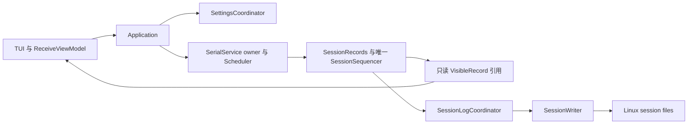

# LazyCom 架构优化实施结果

日期：2026-09-20。对应 [架构优化方案](architecture-optimization-plan.md)。产品契约以 [Plan.md](../Plan.md) 为准，工程契约以 [DevelopPlan.md](../DevelopPlan.md) 为准。

## 1. 交付范围

A1–A4、B1–B4 和 C2 已实施并通过自动验证。C1 已完成生产共享记录、唯一 sequencer 和记录引用预算接入；八类运行时预算尚未全部闭环，因此 C1 的完整预算验收仍未完成。真实 USB-UART 和长时压力验证也未完成。

主要功能、快捷键、菜单层级和持久化格式保持既有契约。预算达到上限时，生产记录路径现在实际执行资源拒绝策略；这部分属于资源契约的接入，不能作为严格等价重构描述。

## 2. 架构变化

| 任务 | 已实施内容 | 主要位置 |
| --- | --- | --- |
| A1 | 设置入口接收具名候选、枚举和整数；删除内部逗号/竖线字符串协议 | `app/application`、`ui/tui` |
| A2 | worker 信号、会话命令和配置值类型下移；删除无消费者的通用 completion/event 声明；底层公共头不再反向包含 app | `base/worker_signals.hpp`、`model/session_types.hpp`、`config/types.hpp` |
| A3 | 统一 strict UTF-8、UTC 校验及相同的安全 message projection；保留 payload 显示的独立转义规则 | `base/text`、encoding、config、logging |
| A4 | Linux 目录、文件、锁和配额后端与异步 writer 分离；复用内部 fd RAII | `logging/linux_session_files.cpp`、`platform/file_descriptor.hpp` |
| B1 | 三份文档的身份、保留文本、保存 future、dirty/read-only 和 quick-send 待提交候选由单一组件维护 | `app/settings_coordinator` |
| B2 | writer、Start/End/Disable、rollover/backlog、关闭 owner、重建和 deadline 归入日志协调器 | `app/session_log_coordinator` |
| B3 | 覆盖层改为 `ModalKind` 和具体候选状态；保留有界栈、父页面、焦点及编辑恢复 | `ui/modal_state.hpp` |
| B4 | 分帧、可见记录和统计归入 SessionRecords；过滤坐标、viewport、稳定 cursor 和搜索导航归入 ReceiveViewModel | `app/session_records`、`ui/receive_view_model` |
| C1（记录部分） | 唯一生产 sequencer；UI/log 共享不可变记录；writer 直接编码共享记录；单记录批次内联存储 | model、SessionRecords、SessionWriter |
| C2 | scheduler 由 serial owner 推进，合并 I/O deadline；可靠启动/替换/停止 completion；删除独立 scheduler CMake target | `serial/service`、`scheduler`、CMake |

Application 保留连接状态机、命令守卫、事件处理顺序、跨组件断开 barrier 和正常/FATAL 退出。新协调器没有新增线程，不回调修改应用状态。

`lazycom_data_path` 不再依赖 logging；logging 使用纯 model。`logging::Record` 留作持久格式编解码值类型，不再作为生产 UI/log fan-out 的第二份 payload。

定时任务的提交携带 connection/session 身份、执行快照和预期替换 generation。owner 自动 TX 与应用操作共用 `OperationIdIssuer`。UI 不再通过 tick 驱动调度，也不维护对应的 TX-operation 映射。手工发送优先、超时、旧任务部分写前缀、停止确认和 cleanup 的顺序由 owner 保证。

## 3. 记录与资源边界

每个生产批次只包含一条记录，保持逐条淘汰，不因一个可见记录保留大批次中的其他 payload。跨连接 `record_id` 与会话内 `seq` 分开维护。正常记录只在 Active 接纳；进入 Cleanup 后拒绝 Normal；关闭后不再接纳。

UI 的 payload/span 和文本 view 由同一 `SessionRecordBatchPtr` 保活。日志关闭时不构造日志专用 payload 副本；日志开启时，worker 在编码边界读取同一存储。UI 清空或淘汰不会提前归还日志仍在使用的 token。

当前预算覆盖清单如下。**表中“未接入”仍受既有大小、条数或配置组合限制，但这些限制不等于分配前统一 token 预留。**

| 类别 | 已接入统一 token 的生产对象 | 尚未接入或尚未证明完整覆盖 |
| --- | --- | --- |
| UiRecords，48 MiB | SharedPayload 字节与对象/控制块；批次和字段的保守 metadata；VisibleRecord 引用及节点估算 | admission 前的 RecordDraft 时间/message 临时值、容器空块及其他未逐项核验开销 |
| SessionLog，16 MiB | writer BatchItem/variant 节点、rollover PendingLogRecord 节点 | header、编码 JSON/string、control item、promise/future、barrier/disable 容器、Error/path、Linux 配额清单和缓存 |
| RxIngress，8 MiB | 无 | SerialDataEvent 字节、队列与 drain 临时容器 |
| Tx，8 MiB | 无 | 发送草稿、解析结果、排队/活动 TX 和定时任务的发送副本 |
| TxHistory，16 MiB | 无 | 历史 deque/string |
| Diagnostics，8 MiB | 无完整 worker | 内部诊断队列、消息与 sink；完整实现仍是既有发布待办 |
| OwnerScratch，16 MiB | 无 | owner 命令、framer 缓冲及输出、任务执行/替换快照、工作 scratch |
| Model，8 MiB | 无 | 配置/quick-send/state、持久化候选和序列化临时量、scanner 结果、搜索 ID/过滤坐标、notice/error、completion/控制槽及其他有界状态 |

共享 payload/batch 固定计入 UiRecords，即使最后仅被日志持有，也保持原类别记账；SessionLog 只为自身新增的引用节点预留。日志的逻辑消息数/字节数另外限额，不能把两个 sink 的逻辑字节相加当作实际共享分配量。

当前过载处理：记录预算不足先淘汰可见旧记录；仍无法接纳则增加 gap、使活动日志进入 ERROR，RX 丢失时请求可靠断开。预算拒绝不会进入 OOM FATAL；真正分配异常仍由既有异常边界处理。日志节点预算不足按日志队列满处理，不阻塞 serial owner。

完整 128 MiB 验收仍需逐类接入上述分配，在 admission 前取得 token，并覆盖 drain、取消、迟到 completion、替换和退出后的归还。不能通过一次预留整个类别额度来代替对象生命周期记账。本次也没有削弱现有分类上限，或把未接入的分配解释为已经受 token 保护。

## 4. 验证结果

本次环境为 Fedora Linux 44、Linux 7.2.5，GCC 16.2.1、Clang 22.1.8、CMake 4.3.0、Ninja 1.13.2。使用仓库固定依赖，没有升级依赖或修改 vendored code；该环境验证不能替代 Ubuntu 24.04 基线机器的发布验证。

最终 CTest 实际发现 **113 项**。以下均为当前实现的完整集合，包含 extended 和 bundled dependency build 用例；不是快速 preset 的结果。

| preset | 构建 | 完整测试 | 测试耗时 |
| --- | --- | --- | --- |
| `gcc-debug` | 通过 | 113/113 | 20.52 s |
| `clang-debug` | 通过 | 113/113 | 20.84 s |
| `gcc-release` | 通过 | 113/113 | 15.92 s |
| `gcc-debug-no-diagnostics` | 通过 | 113/113 | 14.02 s |
| `gcc-asan-ubsan` | 通过 | 113/113 | 32.44 s |
| `gcc-tsan` | 通过 | 113/113 | 43.81 s |

ASan/UBSan 在沙箱外运行，以避开 LeakSanitizer 的 ptrace 环境限制，没有关闭泄漏检查；UBSan 保持 `halt_on_error=1`。TSan 与 ASan 分开运行，未报告项目数据竞争。各构建保留 warnings-as-errors。测试时部分构建并行进行，上表耗时仅是执行记录，不用于比较编译器性能。

标准复现命令为 `cmake --preset <preset>`、`cmake --build --preset <preset>`、`ctest --preset <preset>`。迭代复核还运行了 application/logging/budget/scheduler 定向测试、GCC fast 集合、`git diff --check` 和改动 C++ 文件的 clang-format。

新增 5 个聚合测试使基线从 108 项增加到 113 项，没有恢复此前删除的稳定功能镜像测试：

1. ReceiveViewModel 的稳定 ID、过滤后坐标、淘汰回退和搜索清理。
2. owner 任务的待启动取消、精确替换身份和 shutdown terminal outcome。
3. 无 UI tick 时的调度、手工 TX 超时后继续调度、部分旧 TX 替换及快照 capacity 上限。
4. 生产 UI/log 共享同一 payload，UI 淘汰后日志继续持有，最终归还预算；同时检查跨 session seq/record ID 与低预算拒绝。
5. 真实 Application 注入低记录预算后，日志 ERROR、RX 断开、gap 可见、无 FATAL 且正常退出归还 token。

已有 PTY 用例扩展了 owner 自动定时发送和停止确认后无后续写入。外部 PTY TUI 烟测运行实际应用，检查 G/D/V/F 两级页面、Help 返回、quick-send 编辑内容恢复、搜索粘贴和正常退出。它没有覆盖全部鼠标拖选、终端兼容或真实串口硬件行为。

独立只读复核检查了共享存储生命周期、metadata 估算、单记录重试、pending Start/rollover 的过载收敛及 owner 调度竞态。发现的 quota→FATAL、替换前旧 TX 再写和手工超时阻塞单次调度问题均已修正并重新验证。

## 5. 规模与性能取舍

按 `.cpp/.hpp` 统计，基线为实施前的 `ba548f5`，当前包含新增文件、不包含 vendored code：

| 范围 | 之前 | 之后 | 净变化 |
| --- | ---: | ---: | ---: |
| 生产 `.cpp` | 16,423 | 16,919 | +496 |
| 项目头文件 | 4,434 | 4,718 | +284 |
| 测试与测试支持 C++ | 5,671 | 6,122 | +451 |
| Application 实现 | 2,743 | 1,871 | −872 |
| TUI 实现 | 3,149 | 2,969 | −180 |
| serial service 实现 | 1,958 | 2,272 | +314 |
| session writer 实现 | 1,727 | 835 | −892 |

生产总行数增加 780 行，原因包括具名协调器接口、共享存储接入和 owner 内任务生命周期。较大的 Application/writer 文件缩小并不代表总代码减少；收益主要是删除平行状态、字符串协议、重复 payload 和反向模块依赖。

为检查共享记录代价，使用同一 GCC `-O2 -std=c++20` 微基准比较 C1 前检查点和当前实现：每次接纳 20,000 条固定长度 RX，UI 使用默认 32 MiB，模拟日志保留最近 256 条；不含串口、线程、磁盘与 NDJSON 编码。每个输入串行运行 7 次，取中位数。分配字节是 `operator new` 请求的累计值，不是峰值内存或进程 RSS。

| 每条 payload | 累计分配字节，之前 → 之后 | 接纳耗时，之前 → 之后 |
| --- | ---: | ---: |
| 1 B | 8,087,792 → 11,283,664 | 4.931 → 9.367 ms |
| 64 B | 10,607,792 → 12,543,664 | 6.129 → 10.574 ms |
| 1 KiB | 49,007,792 → 31,743,664 | 11.037 → 15.045 ms |
| 64 KiB | 2,629,334,256 → 1,321,830,128 | 201.292 → 102.072 ms |

小记录增加了共享元数据和预算检查成本；大 payload 从两份复制降为一份，减少累计分配。单记录内联批次和 `make_shared` 已消除新增的临时 vector/独立控制块分配，在前三组中分配调用数从 113,347 降到 107,303，但这不抵消所有小记录场景的时间和空间成本。64 KiB 组最终可见记录为 510 → 508，反映元数据计量不同。不能据此宣称全应用普遍提速。

## 6. 未完成的验收

- C1 剩余运行时类别的预算 token 闭环，详见第 3 节。
- 三类真实 USB-UART 的权限、拔插、驱动与高波特率矩阵。
- 8 小时 2 Mbaud 压力、完整进程 RSS 与队列高水位、最大记录列表的导航/搜索性能和空闲唤醒对照。
- 完整 diagnostics worker、安全 sink 和发布文档，仍属于既有阶段 7 工作。

本次未执行 commit、push 或依赖升级。此前测试精简结果及其他历史报告保持原样，新的验证结论以本文为准。
